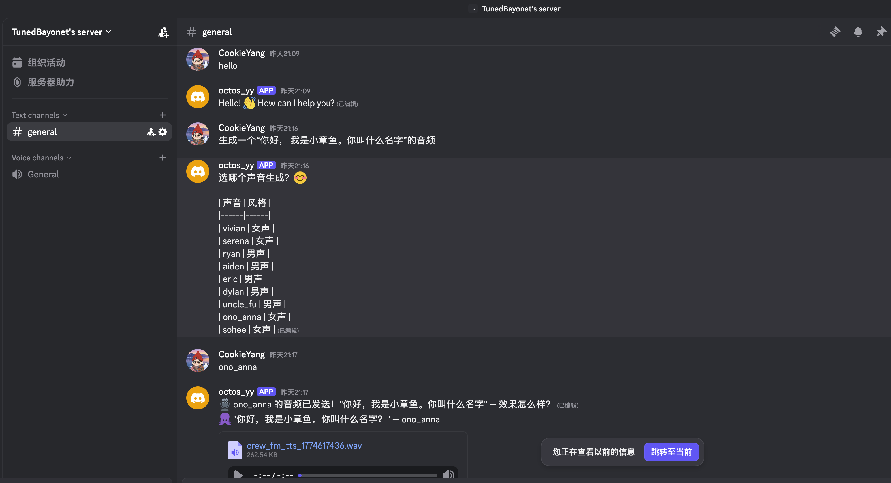
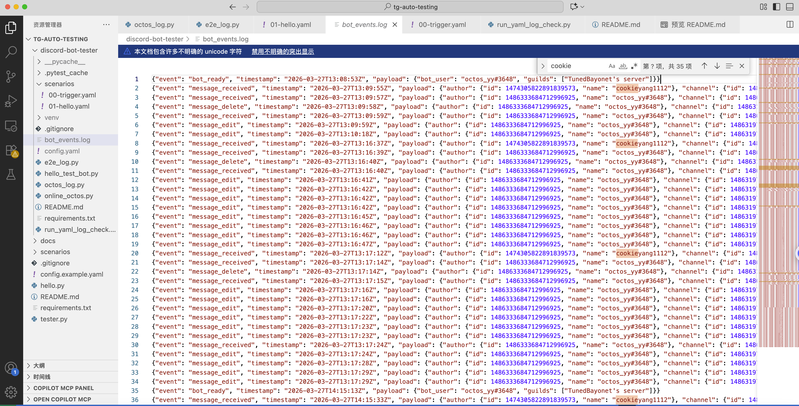
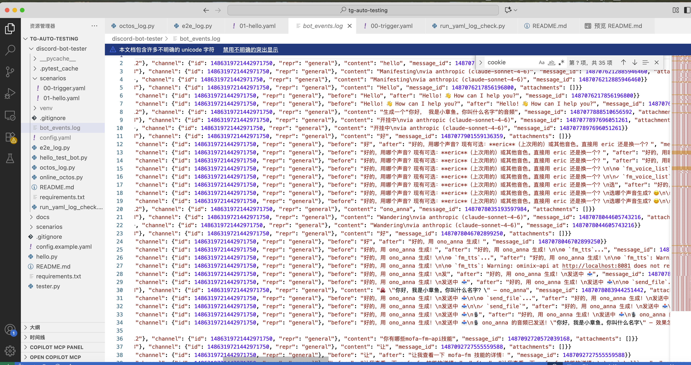
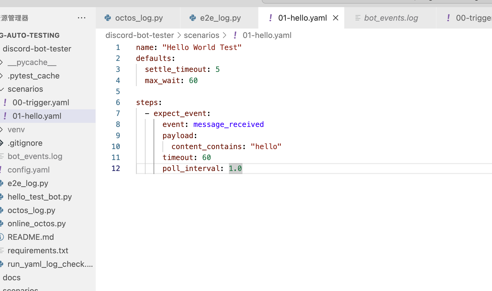
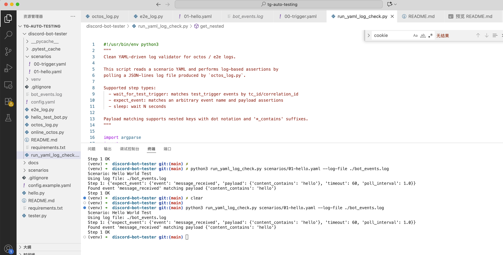

# discord-scenario-bot User Manual

Discord Bot 场景测试工具 — 以真实用户身份向 Discord bot 发送消息，捕获完整响应生命周期，执行断言，生成测试报告。

---

## 目录

1. [前置条件](#1-前置条件)
2. [安装](#2-安装)
3. [测试](#3-测试)

---

## 1. 前置条件

| 项目 | 说明 |
|------|------|
| Python 3.10+ | 系统已安装 |
| Discord Bot | 已创建并邀请到服务器 |
| Bot Token | 从 Discord Developer Portal 获取 |

### 获取 Discord Bot Token

1. 打开 https://discord.com/developers/applications
2. 点击 **New Application**，填写名称后创建
3. 左侧菜单选择 **Bot**
4. 点击 **Reset Token**，复制并保存 Token（**只显示一次！**）
5. 启用 **Message Content Intent** 和 **Server Members Intent**
6. 左侧菜单选择 **OAuth2 → URL Generator**
7. 选择 **scopes**: `bot`
8. 选择 **bot permissions**: 
   - Send Messages
   - Read Message History
   - Manage Messages
   - Message Content Intent
9. 复制生成的 URL，在浏览器打开，邀请 Bot 到你的服务器

---

## 2. 安装

```bash
cd discord-bot-tester
python3 -m venv venv
source venv/bin/activate
pip install -r requirements.txt
```
## 示例截图

下面是 `docs` 目录中的示例截图：

[](docs/0.png) [](docs/1.png) [](docs/2.png)  
[](docs/3.png) [](docs/4.png)


---

## 3. 测试

开启一个终端， export DISCORD_BOT_TOKEN后
```bash
export DISCORD_BOT_TOKEN="xxx"
python octos_log.py
```

新开启一个终端
```bash
python3 run_yaml_log_check.py scenarios-fm/01-hello.yaml --log-file ./bot_events.log
```

也可以运行新增的混合场景与上下文场景 YAML：

```bash
python3 run_yaml_log_check.py scenarios-fm-mixed/01-fm-混合-生成后上传单集.yaml --log-file ./bot_events.log
python3 run_yaml_log_check.py scenarios-fm-context/01-fm-上下文-删除确认并完成.yaml --log-file ./bot_events.log
```

如果你想一次性运行一个目录下的多个 YAML 并生成聚合报告（JSON/HTML），可以使用新增的脚本：

```bash
# 运行 scenarios-fm-mixed 下所有 .yaml，并输出 JSON 与 HTML 报告
python3 run_all_and_report.py scenarios-fm-mixed --log-file ./bot_events.log --report ./report.json --html-report ./report.html
```
